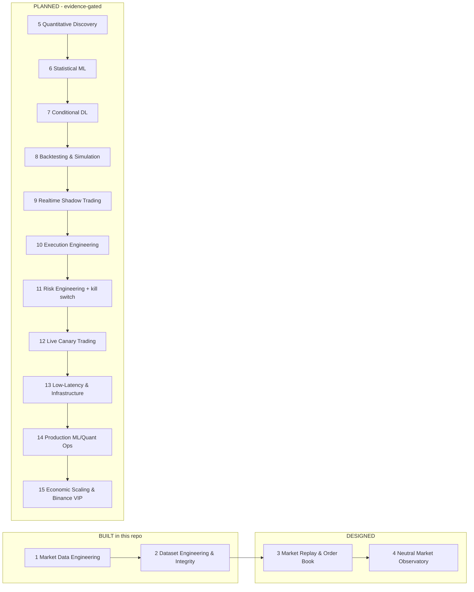

# bnnc-pro-elite

**Exchange-grade market data engineering for Binance Spot (BTCUSDT/ETHUSDT) with forensic
data integrity — built in Rust and Python, verified by two independent implementations, and
soaked live in production for 24 hours.**

This repository implements **Phases 1–2** of a 15-phase trading-system roadmap: dual-lane
hot-redundant raw capture → canonical arbitration → sealed hash-chained journal →
independent dual-language verification. The remaining phases are described honestly in
[docs/ROADMAP.md](docs/ROADMAP.md) with entry/exit criteria — no speculative code, no fake
claims.

---

## Venue-connectivity layer (C++, 2026-09-18)

For the market-data-engineering skill surface (feed handlers, normalization,
distribution, venue connectivity), this repository also ships a C++ layer in
[`cpp/`](cpp/README.md) — every codec built from a captured, SHA256-pinned
specification with test-red → implementation → test-green discipline:

- **ITCH 5.0** decoder and **OUCH 5.0** order-entry semantics (big-endian,
  fixed-point prices, ns timestamps) — golden vectors byte-built from the
  captured official Nasdaq specs →
  [`cpp/evidence/EVIDENCE_01_ITCH_OUCH.md`](cpp/evidence/EVIDENCE_01_ITCH_OUCH.md)
- **SBE** decoder for the pinned Binance Spot schema (`stream_1_0.xml`,
  SHA256 `6EA32846…10A1F7`), cross-checked field-by-field against the
  OFFICIAL SBE code generator output →
  [`cpp/evidence/EVIDENCE_02_SBE.md`](cpp/evidence/EVIDENCE_02_SBE.md)
- **Multicast UDP** transport (join/leave, sequence recovery, NAK
  retransmission, snapshot bridging) with a real loss→retransmission e2e
  test →
  [`cpp/evidence/EVIDENCE_03_MULTICAST.md`](cpp/evidence/EVIDENCE_03_MULTICAST.md)
- **Instant typed loss recovery** (cadence + watchdog silence detection,
  A/B arbitration, Binance diff-depth book continuity) and **layered
  anti-loss capture** (live → cache → REST backfill with
  `captured-live`/`backfilled` provenance) →
  [`cpp/evidence/EVIDENCE_03B_RECOVERY.md`](cpp/evidence/EVIDENCE_03B_RECOVERY.md),
  [`cpp/evidence/EVIDENCE_03C_RESILIENCE.md`](cpp/evidence/EVIDENCE_03C_RESILIENCE.md)
- **FIX 4.4 session layer** (logon/heartbeat/resend/sequence-reset with
  NextNumIn/Out persistence) →
  [`cpp/evidence/EVIDENCE_04_FIX.md`](cpp/evidence/EVIDENCE_04_FIX.md)
- **Measured benchmarks** (p50/p99/throughput, dev + final, anti-cheat) —
  e.g. SBE decode 83 ns p50 vs JSON stdlib 1500 ns p50 →
  [`cpp/bench/benchmarks/`](cpp/bench/benchmarks) +
  [`cpp/evidence/EVIDENCE_05_BENCHMARKS.md`](cpp/evidence/EVIDENCE_05_BENCHMARKS.md)
- **Measured live latency host ↔ venue** (independent public probe, does not
  touch the productive service): depth p50 **119.9 ms** / p99 131.0 ms,
  trades p50 124.6 ms, REST+WS RTT **371–388 ms**, declared uncertainty
  ±186 ms without PTP →
  [`cpp/probe/REPORT.md`](cpp/probe/REPORT.md) +
  [`cpp/probe/report.json`](cpp/probe/report.json)
- **CI on Linux + Windows** (Rust + Python + C++ suites, cfg-gate for the
  Windows-only `windows_etw`/`windows_tcp` modules) →
  [`.github/workflows/ci.yml`](.github/workflows/ci.yml)

All new C++ suites are green: 57/57 tests
([`cpp/evidence/logs/ALL_PHASES_GREEN_20260918.log`](cpp/evidence/logs/ALL_PHASES_GREEN_20260918.log),
SHA256 `BE00419C…4870`). The Binance SBE production lane is deferred by the
capture policy until the JSON gates close and an Ed25519 market-data-only key
exists —
[`cpp/evidence/EVIDENCE_07_SBE_INTEGRATION.md`](cpp/evidence/EVIDENCE_07_SBE_INTEGRATION.md).

---

## Why this is different

- **Zero silent loss.** Every discontinuity in the canonical stream is a **typed GAP record**
  with an exact reason (`unprovable_continuation`, `transport_dead`, `exchange_silent`),
  counted and auditable by construction. Fabricating zero gaps is forbidden by design.
- **Forensic integrity.** Every raw frame and canonical record is hash-chained
  (SHA-256, `previous_record_sha256`); every epoch window is sealed and verified.
- **Dual-language oracles.** Independent Rust and Python verifiers must agree. The full
  historical replay (1.57M records per symbol) reconciles **byte-identical**: the Python
  verification reports have the exact same SHA-256 as the historical run
  (`evidence/g2-reconciliation.json`).
- **Fault-injection gates on the real live path.** Arbiter crash mid-publication, supervisor
  kill, hung verifier — injected, recovered and TYPED; the closed-set oracle still verifies
  (`verified=true`, `errors=[]`).
- **Self-maintaining service.** Planned epoch handovers with overlap (capture never stops),
  per-lane circuit breaker (5 consecutive failures → 60 s cooldown, half-open probe),
  watchdog ping/pong typing transport-dead vs exchange-silent, cooperative stop with
  kill-on-close job object.

## Architecture (built)

```mermaid
flowchart LR
    subgraph EX[Binance Spot public data]
        W1[WS depth@100ms]
        W2[WS trade]
        W3[REST snapshot / api/v3/time]
    end
    W1 --> P[PRIMARY lane<br/>raw_campaign + segmented_capture]
    W2 --> P
    W1 --> S[SHADOW lane]
    W2 --> S
    WD[Watchdog ping/pong 30s/5s] --> P
    WD --> S
    CB[Per-lane circuit breaker] --> P
    CB --> S
    P --> R1[(raw .bnraw<br/>SHA-256 chained + ACKs)]
    S --> R2[(raw .bnraw)]
    R1 --> ARB[Canonical Arbitrator<br/>trade-union watermark + order book]
    R2 --> ARB
    ARB --> J[(canonical journal<br/>hash-chained segments)]
    J --> V1[Rust verifier]
    J --> V2[Python verifier]
    V1 --> VER{Byte-identical verdicts + digests}
    V2 --> VER
    VER -->|PASS| SEAL[Sealed window + typed gaps audited]
    subgraph CPP[Venue-connectivity layer (cpp/, 2026-09-18)]
        ITCH[ITCH 5.0 + OUCH codecs]
        SBE[SBE Binance decoder<br/>cross-checked vs official codegen]
        NET[Multicast UDP + seq recovery<br/>NAK retransmission]
        REC[Typed silence detection<br/>A/B arbitration + snapshot bridging]
        RES[Layered anti-loss<br/>live -> cache -> REST backfill]
        FIX[FIX 4.4 session<br/>logon/heartbeat/resend]
    end
    CPP --> BENCH[Benchmarks measured<br/>SBE 83 ns p50 decode]
    CPP --> CI[CI Linux + Windows<br/>Rust + Python + C++ green]
    W1 -. latency probe .-> PROBE[Measured delay<br/>depth p50 120 ms / RTT 371-388 ms]
    W3 -. clock offset .-> PROBE
    BENCH --> EV[evidence/ + cpp/evidence/]
    CI --> EV
    PROBE --> EV
```

Every box in the C++ layer traces to a captured, SHA256-pinned spec and to a
file under `cpp/evidence/` (see the "Venue-connectivity layer" section above).


## Roadmap (15 phases, honest status)



Full phase definitions with entry/exit criteria: [docs/ROADMAP.md](docs/ROADMAP.md).
The governance loop that rules every phase (no speculation): [docs/INTEGRITY.md](docs/INTEGRITY.md).

## Evidence (measured, not claimed)

| Gate | Result |
|---|---|
| Fault gate — injected failures on the real live path | exit 0, `verified=true` |
| Service gate — 30 virtual days, renewals sealed + verified | exit 0, `errors=[]`, `outer_gaps=0`, 27/27 renewals |
| G2 replay reconciliation, Rust vs Python (1.57M records/symbol) | `verdict: PASS`, byte-identical reports |
| Production soak (live, 24 h) | preflight `PASS`, per-epoch verification `PASS` (Rust + Python), live incremental verification `oracle_identity: PASS` |

Artifacts: [evidence/](evidence/) — frozen release manifest, gate logs, reconciliation,
live-run summary.

## Tech stack

- **Rust 1.98** (MSVC): capture lanes, canonical arbitrator, verifiers, hash-chained journal,
  circuit breaker, watchdog, fault directives, kernel ETW network observer.
- **Python 3.14** (stdlib-only verification): independent oracles for trades, depth book
  digests (byte-identical contract), segment-chain audits.
- **C++20** (MSVC `cl` on Windows, `g++` on Linux CI): ITCH 5.0, OUCH 5.0, Binance SBE,
  multicast UDP + sequence recovery, typed loss recovery, layered anti-loss capture, FIX 4.4
  session — `cpp/`, all suites green on both platforms.
- Deterministic models for every live path, property/contract tests, red-green discipline.

## Run it

```powershell
# build (release)
cargo build --release

# production continuous service (elevated console; kernel observers enabled)
powershell -NoProfile -ExecutionPolicy Bypass -File scripts\run_hot_redundant_qualification.ps1 -Mode Continuous

# cooperative stop
[IO.File]::WriteAllBytes("artifacts\hrs\hrs-<nonce>\stop.request", [byte[]]@())
```

Operational details: [docs/RUNBOOK.md](docs/RUNBOOK.md). Full architecture walkthrough:
[docs/ARCHITECTURE.md](docs/ARCHITECTURE.md).

## License

MIT — see [LICENSE](LICENSE).
