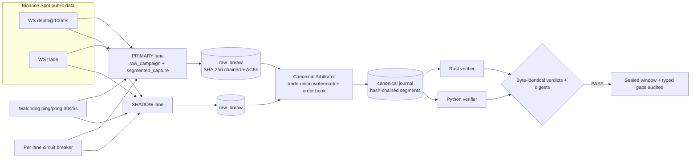
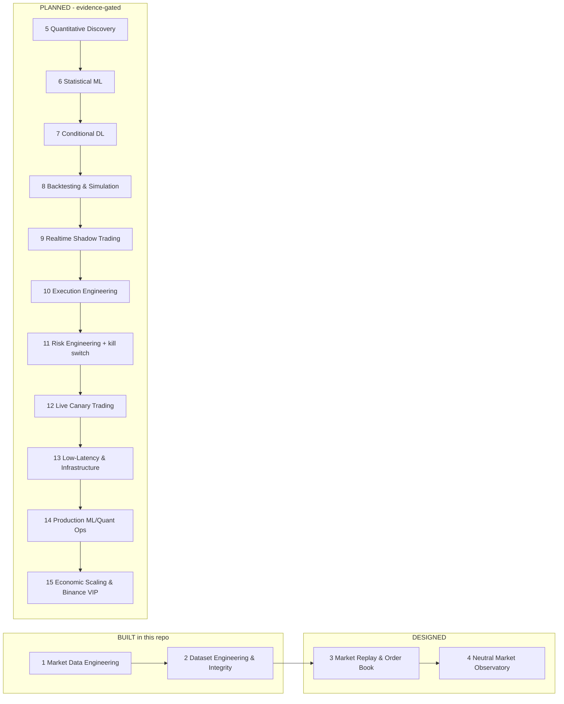

# bnnc-pro-elite

**Exchange-grade market data engineering for Binance Spot (BTCUSDT/ETHUSDT) with forensic
data integrity — built in Rust and Python, verified by two independent implementations, and
soaked live in production for 24 hours.**

This repository implements **Phases 1–2** of a 15-phase trading-system roadmap: dual-lane
hot-redundant raw capture → canonical arbitration → sealed hash-chained journal →
independent dual-language verification. The remaining phases are described honestly in
[docs/ROADMAP.md](docs/ROADMAP.md) with entry/exit criteria — no speculative code, no fake
claims.

---

## Why this is different

- **Zero silent loss.** Every discontinuity in the canonical stream is a **typed GAP record**
  with an exact reason (`unprovable_continuation`, `transport_dead`, `exchange_silent`),
  counted and auditable by construction. Fabricating zero gaps is forbidden by design.
- **Forensic integrity.** Every raw frame and canonical record is hash-chained
  (SHA-256, `previous_record_sha256`); every epoch window is sealed and verified.
- **Dual-language oracles.** Independent Rust and Python verifiers must agree. The full
  historical replay (1.57M records per symbol) reconciles **byte-identical**: the Python
  verification reports have the exact same SHA-256 as the historical run
  (`evidence/g2-reconciliation.json`).
- **Fault-injection gates on the real live path.** Arbiter crash mid-publication, supervisor
  kill, hung verifier — injected, recovered and TYPED; the closed-set oracle still verifies
  (`verified=true`, `errors=[]`).
- **Self-maintaining service.** Planned epoch handovers with overlap (capture never stops),
  per-lane circuit breaker (5 consecutive failures → 60 s cooldown, half-open probe),
  watchdog ping/pong typing transport-dead vs exchange-silent, cooperative stop with
  kill-on-close job object.

## Architecture (built)



## Roadmap (15 phases, honest status)



Full phase definitions with entry/exit criteria: [docs/ROADMAP.md](docs/ROADMAP.md).
The governance loop that rules every phase (no speculation): [docs/INTEGRITY.md](docs/INTEGRITY.md).

## Evidence (measured, not claimed)

| Gate | Result |
|---|---|
| Fault gate — injected failures on the real live path | exit 0, `verified=true` |
| Service gate — 30 virtual days, renewals sealed + verified | exit 0, `errors=[]`, `outer_gaps=0`, 27/27 renewals |
| G2 replay reconciliation, Rust vs Python (1.57M records/symbol) | `verdict: PASS`, byte-identical reports |
| Production soak (live, 24 h) | preflight `PASS`, per-epoch verification `PASS` (Rust + Python), live incremental verification `oracle_identity: PASS` |

Artifacts: [evidence/](evidence/) — frozen release manifest, gate logs, reconciliation,
live-run summary.

## Tech stack

- **Rust 1.98** (MSVC): capture lanes, canonical arbitrator, verifiers, hash-chained journal,
  circuit breaker, watchdog, fault directives, kernel ETW network observer.
- **Python 3.14** (stdlib-only verification): independent oracles for trades, depth book
  digests (byte-identical contract), segment-chain audits.
- Deterministic models for every live path, property/contract tests, red-green discipline.

## Run it

```powershell
# build (release)
cargo build --release

# production continuous service (elevated console; kernel observers enabled)
powershell -NoProfile -ExecutionPolicy Bypass -File scripts\run_hot_redundant_qualification.ps1 -Mode Continuous

# cooperative stop
[IO.File]::WriteAllBytes("artifacts\hrs\hrs-<nonce>\stop.request", [byte[]]@())
```

Operational details: [docs/RUNBOOK.md](docs/RUNBOOK.md). Full architecture walkthrough:
[docs/ARCHITECTURE.md](docs/ARCHITECTURE.md).

## License

MIT — see [LICENSE](LICENSE).
