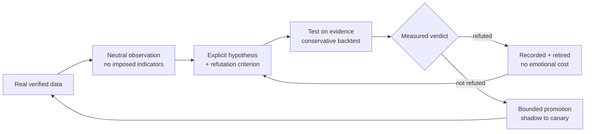

# Roadmap — 15 phases, evidence-gated

Every phase below has an entry criterion (what must be VERIFIED before starting) and an exit
criterion (what proves it done). No phase starts on opinion; no phase claims results it does
not have. Status: ✅ BUILT · 🚧 DESIGNED · 📋 PLANNED.

| # | Phase | Status | Entry criterion | Exit criterion |
|---|---|---|---|---|
| 1 | Market Data Engineering — WebSocket connection, raw capture, timestamps, telemetry, storage | ✅ | — | Dual-lane raw capture of BTCUSDT/ETHUSDT with ACK-durable logs, clock metadata, transport journals |
| 2 | Dataset Engineering & Data Integrity — durability, hashes, segmentation, continuity, handovers, audit, qualification | ✅ | Phase 1 done | Hash-chained segments, sealed windows, dual-language oracle verification PASS, fault gates `verified=true` |
| 3 | Market Replay & Order Book Reconstruction — event-by-event replay, exact book rebuild | 🚧 | Phase 2 verified in production | Replay reproduces canonical output exactly from raw, book digests byte-identical |
| 4 | Neutral Market Observatory — full exposure of everything observed, no imposed indicators | 🚧 | Phase 3 done | Read-only observatory over verified data, zero derived signals |
| 5 | Quantitative Discovery — open discovery of structures/behaviors that emerge naturally | 📋 | Phase 4 done | Cataloged emergent structures with explicit refutation criteria |
| 6 | Statistical Learning / ML — learning over what was discovered, no a-priori "what must work" | 📋 | Phase 5 done | Models with defined train/validation split on verified data, honest performance reports |
| 7 | Deep Learning — temporal/representation models ONLY if data proves they add value | 📋 | Phase 6 shows an evidence gap ML cannot close | DL beats the ML baseline on held-out data, measured |
| 8 | Execution Simulation & Backtesting — conservative entries/exits/fills/commissions/spread/slippage/latency | 📋 | Phase 6/7 done | Simulator validated against real fills where available; no optimistic assumptions |
| 9 | Realtime Shadow Trading — system decides in real time, sends no orders | 📋 | Phase 8 done | Shadow P&L tracked against realized market conditions |
| 10 | Execution Engineering — private APIs, Testnet, orders, cancels, fills, reconciliation, User Data Stream | 📋 | Phase 9 done | Testnet execution reconciles exactly; UDS handled |
| 11 | Risk Engineering — limits, inventory, exposure, losses, unknown states, kill switch | 📋 | Phase 10 done | Kill switch verified by gate; every unknown state typed and handled |
| 12 | Live Canary Trading — real operation with minimum capital, full control | 📋 | Phase 11 done | Canary metrics meet pre-declared thresholds |
| 13 | Low-Latency & Infrastructure — Rust/C++, networking, hardware, cloud location | 📋 | Phased with 10-12 | Latency budget measured and met |
| 14 | Production ML/Quant Operations — drift, reproduction, versioning, promote/retire | 📋 | Phase 12 done | Every algorithm has reproduction + retire path |
| 15 | Economic Scaling & Binance VIP — reversible scaling only via proven net profit | 📋 | Phase 12-14 done | Scale-up decisions backed by audited net profit, reversible |

The pipeline in one line: **Data → integrity → replay → neutral observation → discovery →
ML/DL → simulation → shadow → execution → risk → live → scale.**

## Governance loop (rules every phase)

